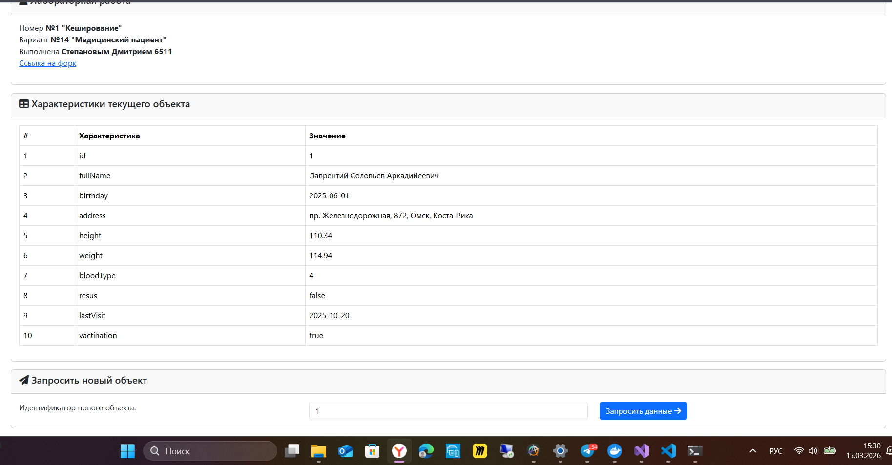
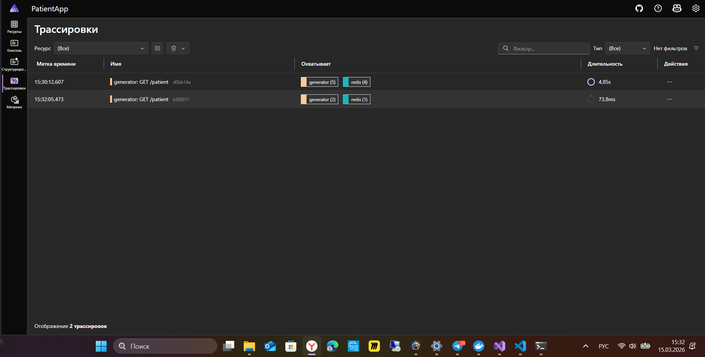

# Cloud Development (вариант 14 «Медицинский пациент»)

> Студент: Дмитрий Степанов, группа 6511.

## Описание

- **GeneratorService** — минималистичный ASP.NET Core API, который генерирует карточку пациента по идентификатору, кеширует результат в Redis и отдает его клиенту.
- **Patient** — папка с оркестратором .NET Aspire AppHost.

## REST API

### `GET /patient?id={int}`

| Параметр | Тип | Обязателен | Описание |
|----------|-----|------------|----------|
| `id`     | int (>0) | да | Одновременно идентификатор пациента и seed для генератора; проверяется на положительность. |

Ответ `200 OK` содержит JSON‑объект с полями:

| Поле          | Тип      | Пример                         | Описание                               |
|---------------|----------|--------------------------------|----------------------------------------|
| `id`          | int      | `42`                           | Первичный ключ записи.                 |
| `fullName`    | string   | `«Ирина Смирнова Сергеевна»`   | ФИО пациента на русском языке.        |
| `birthday`    | DateOnly | `1993-07-20`                   | Дата рождения.                         |
| `address`     | string   | `«г. Самара, ул. Карла Маркса...»` | Полный адрес.                      |
| `height`      | double   | `167.35`                       | Рост в сантиметрах.                    |
| `weight`      | double   | `61.12`                        | Вес в килограммах.                     |
| `bloodType`   | int      | `2`                            | Группа крови (1–4).                    |
| `resus`       | bool     | `true`                         | Фактор резус.                          |
| `lastVisit`   | DateOnly | `2026-02-17`                   | Дата последнего визита.                |
| `vactination` | bool     | `false`                        | Наличие прививки.                      |

Возможные статусы:

- `200 OK` — данные найдены (из кеша или заново сгенерированы).
- `400 BadRequest` — `id <= 0`.
- `500 Internal Server Error` — непредвиденная ошибка (возвращается `ProblemDetails`).

Повторный вызов с тем же `id` в течение TTL вернет данные быстрее и будет сопровождаться логом «Patient ... was found in cache».

## Структура репозитория

```
cloud-development/
├─ Client.Wasm/
│  ├─ Components/               
│  ├─ Layout/                   
│  ├─ Pages/Home.razor          
│  └─ wwwroot/appsettings.json                    # Конфигурация клиента
├─ GeneratorService/                              
│  ├─ Models/Patient.cs                           # Объектная модель
│  ├─ Services/{Generator,PatientService}.cs      # Сервис генерации и генератор
│  └─ Program.cs
├─ Patient/
│  ├─ Patient.AppHost/
│  └─ Patient.ServiceDefaults/
├─ .github/workflows/setup_pr.yml
├─ CloudDevelopment.sln
└─ LICENSE
```

## Скрины работы


